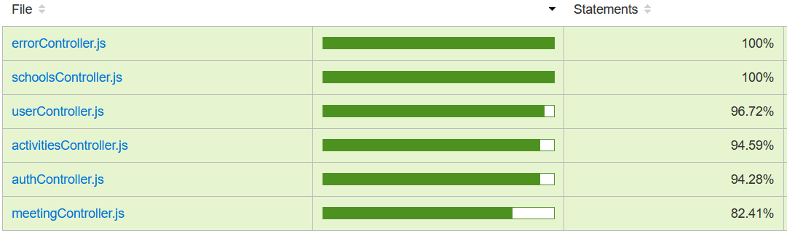

# Owly Eco-School Management Application REST API

## Introduction

This project, developed as part of a school assignment at the Polytechnic Institute of Porto, aims to simplify eco-school project management.

## About Owly

Owly API is tailored to eco-school administrators, coordinators, and council members, providing them with efficient tools for managing meetings, activities, and reports.

## Features

### Main Features

1. **Meetings Management**: Create, update, and delete meetings with subject, date, time, place, and extra notes.

2. **Activity Management**: Propose, approve, and execute activities, including theme, name, supervisors, goals, resources, and results.

3. **Image Upload**: Users can attach images to meetings and activities for documentation.

4. **Email Notifications**: Automatic email notifications are sent to all users when a new meeting is created.

5. **Final Report Generation**: A tool to help in generating reports by selecting images for each activity.

6. **User Roles**: Three user roles - Administrator, Coordinator, and Council Member, with role-specific permissions.

7. **Multi-School Support**: Designed to support multiple schools and their management.

8. **User Registration and Authentication**: User registration, login, and password management with role-based access.

## API Documentation

API documentation for the Owly application can be found [here](https://documenter.getpostman.com/view/27220669/2s93sf2WDZ).

## Testing

Executed testing achieved >80% branch coverage.

- 34 unit tests using `JEST` framework
- 24 integration tests for backend API endpoints using `Supertest`
- Usability testing with `Selenium WebDriver`

Test coverage:

## Tools Used

The Owly API is powered by various technologies and frameworks, including:

- Node.js, Express, Sequelize ORM
- Mailgun: An SMTP service API provider for sending emails.
- Cloudinary: Used for managing media assets stored in the cloud.

## Deployment

The Owly API is deployed on [Cyclic.sh](https://cooperative-attire-goat.cyclic.app)
